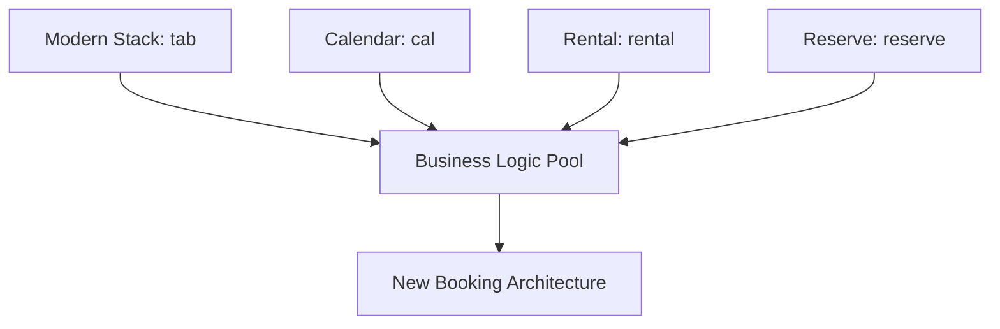

# HexProperty Booking Subsystem Architecture
Version: 1.0.0
Last Updated: 2024-11-28
Status: Draft

## 1. Overview
HexProperty Booking is a subsystem of the main HexProperty platform, focused on property booking and reservation management.

## 2. Business Logic Integration


## 3. Subsystem Architecture
The booking subsystem follows the main HexProperty architecture while maintaining its specific focus on booking operations.

### 3.1 Core Components
```plaintext
/src
  /domain                 // Booking domain logic
    /aggregates
      /booking
      /availability
      /channel
    /events
  /microservices         // Booking-specific services
    /booking-service
    /availability-service
    /channel-service
  /application          // Booking use cases
    /commands
    /queries
  /interface           // Booking API/UI
```

## 4. Integration Points
- Channel Management
- Property Management
- Owner Notifications
- Payment Processing

## 5. Migration Strategy
1. Extract business logic from existing systems
2. Implement core booking functionality
3. Add channel management
4. Integrate with main HexProperty system
