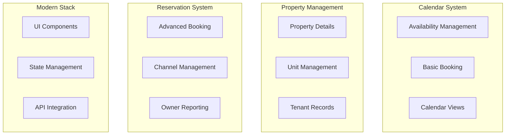
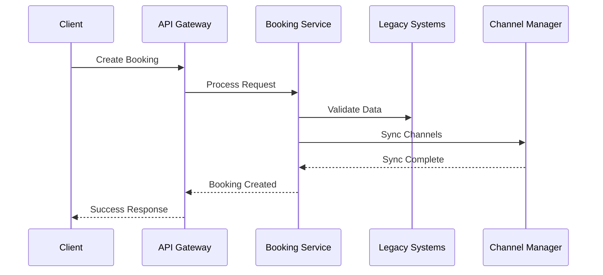

# Business Process Mapping
Version: 1.0.0
Status: Draft
Last Updated: 2024-11-28

## Three-Iteration Analysis

### First Iteration: Stop (Baseline)

#### 1. Legacy Systems Analysis


#### 2. Gap Analysis
| Process Area | Current State | Target State | Gap |
|--------------|---------------|--------------|-----|
| Booking Flow | Fragmented across systems | Unified booking process | Integration needed |
| Channel Management | Basic in reserve | Multi-channel support | Enhancement required |
| Property Data | Duplicated | Single source of truth | Data consolidation |
| UI/UX | Mixed legacy/modern | Modern React/Next.js | Migration path |

#### 3. Critical Paths
1. Reservation Creation
2. Availability Management
3. Channel Synchronization
4. Payment Processing

### Second Iteration: Think (Integration)

#### 1. Integration Points
```typescript
/**
 * Defines the core booking process that integrates all legacy functionalities
 * 
 * @remarks
 * This interface serves as the primary integration point for the booking subsystem.
 * It combines functionality from:
 * - cal: Availability and basic booking
 * - reserve: Advanced booking features
 * - rental: Property management
 * - tab: Modern UI components
 */
interface BookingProcess {
    /**
     * Checks availability across all channels
     * 
     * @param propertyId - Unique identifier for the property
     * @param dateRange - Requested booking dates
     * @returns Promise resolving to availability status
     * @throws AvailabilityError if check fails
     */
    checkAvailability(
        propertyId: PropertyId,
        dateRange: DateRange
    ): Promise<AvailabilityStatus>;

    /**
     * Creates a new booking with channel synchronization
     * 
     * @param bookingDetails - Complete booking information
     * @returns Promise resolving to created booking
     * @throws BookingError if creation fails
     */
    createBooking(
        bookingDetails: BookingDetails
    ): Promise<Booking>;
}
```

#### 2. Technical Considerations
```typescript
/**
 * Manages the transition from legacy systems to new architecture
 * 
 * @remarks
 * This service handles the complexity of maintaining compatibility
 * while migrating to the new system.
 */
class SystemTransitionManager {
    /**
     * Synchronizes data between legacy and new systems
     * 
     * @param entity - Entity to synchronize
     * @param source - Source system identifier
     * @param target - Target system identifier
     */
    async syncData<T extends BaseEntity>(
        entity: T,
        source: SystemId,
        target: SystemId
    ): Promise<void>;
}
```

#### 3. Data Flow


### Third Iteration: Reiterate (Optimization)

#### 1. Performance Optimization
```typescript
/**
 * Optimizes booking performance through caching and prefetching
 * 
 * @remarks
 * Implements advanced caching strategies to improve response times
 * while maintaining data consistency across systems.
 */
class BookingOptimizer {
    /**
     * Prefetches availability data based on user behavior
     * 
     * @param propertyId - Target property
     * @param predictedDates - ML-predicted popular dates
     */
    async prefetchAvailability(
        propertyId: PropertyId,
        predictedDates: DateRange[]
    ): Promise<void>;
}
```

#### 2. Monitoring and Metrics
```typescript
/**
 * Tracks key performance indicators across the booking system
 * 
 * @remarks
 * Provides real-time insights into system performance and user behavior
 */
interface BookingMetrics {
    /**
     * Measures booking completion time
     * 
     * @param bookingId - Booking to measure
     * @returns Duration in milliseconds
     */
    measureBookingDuration(bookingId: BookingId): Promise<number>;
}
```

## Implementation Plan

### Phase 1: Core Migration
1. Set up new booking service
2. Implement availability checking
3. Create basic booking flow
4. Add property management

### Phase 2: Channel Integration
1. Implement channel manager
2. Add synchronization
3. Handle conflicts
4. Test multi-channel scenarios

### Phase 3: Optimization
1. Add caching layer
2. Implement prefetching
3. Set up monitoring
4. Performance tuning

## Testing Strategy

### Unit Tests
```typescript
/**
 * Tests the core booking functionality
 */
describe('BookingService', () => {
    /**
     * Verifies availability checking across systems
     */
    it('should check availability across all channels', async () => {
        // Test implementation
    });
});
```

### Integration Tests
```typescript
/**
 * Tests the interaction between new and legacy systems
 */
describe('SystemIntegration', () => {
    /**
     * Verifies data synchronization
     */
    it('should synchronize booking data with legacy systems', async () => {
        // Test implementation
    });
});
```
