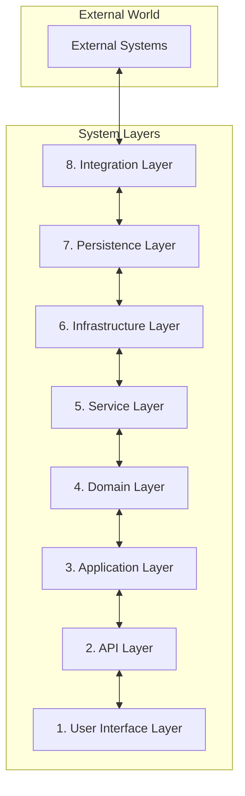
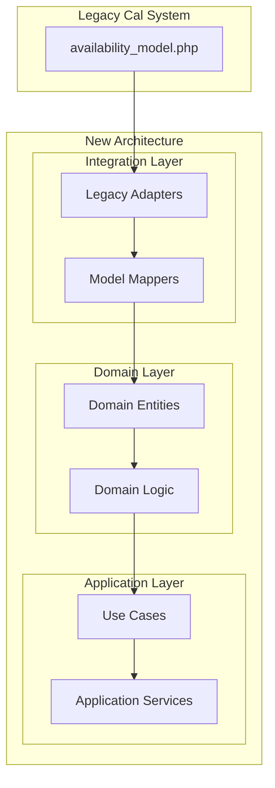

# System Architecture Overview

## 8-Layer Architecture

### Layer Responsibilities

1. **User Interface Layer**
   - Next.js pages and components
   - Client-side state management
   - UI/UX interactions

2. **API Layer**
   - REST/GraphQL endpoints
   - Request/Response handling
   - API versioning

3. **Application Layer**
   - Use case orchestration
   - Transaction management
   - Application-specific logic

4. **Domain Layer**
   - Business entities
   - Domain logic
   - Business rules

5. **Service Layer**
   - Domain service implementation
   - Cross-cutting concerns
   - Service composition

6. **Infrastructure Layer**
   - Technical services
   - Cross-cutting implementations
   - System configuration

7. **Persistence Layer**
   - Data access
   - ORM/Query handling
   - Cache management

8. **Integration Layer**
   - External system adapters
   - Legacy system integration
   - Event handling

### Availability System Integration

### Implementation Guidelines

1. **Domain First**
   - Start with pure domain models
   - Define clear boundaries
   - Implement business rules

2. **Adapter Pattern**
   - Create clean interfaces
   - Isolate legacy code
   - Enable easy replacement

3. **Testing Strategy**
   - Domain logic tests
   - Integration tests
   - Legacy compatibility tests
