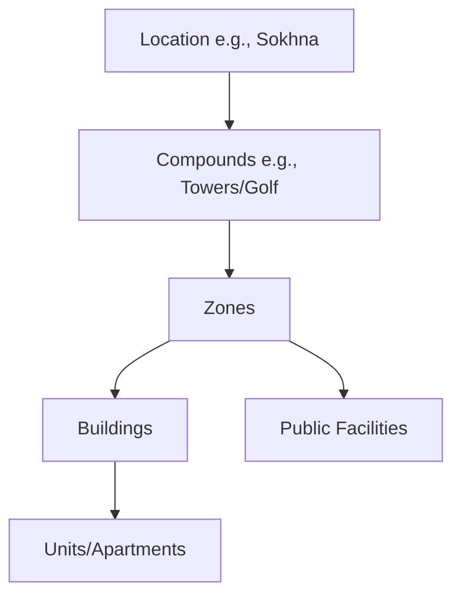

# HexProperty Booking System - Business Logic Specification
Version: 1.0.0
Last Updated: 2024-01-10

## 1. System Context

### 1.1 Scope Definition
Current implementation scope focuses on:
1. Reservation Management
2. Broker Management
3. Security & Access Control
4. Check-in Process
5. Unit Readiness Notifications

### 1.2 Key Stakeholders
1. **Guests** (End Users)
   - Make reservations
   - Receive access credentials
   - Use facilities

2. **Brokers**
   - Manage assigned units (≈50-60 units per broker)
   - Receive unit readiness notifications
   - Coordinate housekeeping/maintenance
   - Monitor unit status

3. **Property Owners**
   - Receive rental notifications
   - View booking details
   - Monitor unit status
   - Access financial information

4. **Security Personnel**
   - Validate guest access
   - Monitor zone access
   - Handle check-in process

## 2. Property Structure

### 2.1 Hierarchy

### 2.2 Access Control Matrix
| Entity Type | Access Scope | Authentication Method |
|-------------|--------------|----------------------|
| Apartments | Unit-specific | QR Code + Facial Recognition |
| Zone Gates | Zone-specific | QR Code + Facial Recognition |
| Public Areas | Compound/Zone based | QR Code + Facial Recognition |

## 3. Business Processes

### 3.1 Reservation Flow
1. **Booking Creation**
   - Validate unit availability
   - Assign to broker pool
   - Generate booking reference

2. **Notifications**
   - Owner notification (SMS + Web link)
   - Broker assignment notification
   - Guest confirmation

3. **Pre-arrival**
   - Broker initiates unit preparation
   - Housekeeping coordination
   - Maintenance checks
   - Readiness confirmation

4. **Check-in**
   - Guest arrival notification
   - Security clearance
   - Access credential generation
   - Unit handover

### 3.2 Broker Management
1. **Unit Assignment**
   - Pool-based allocation
   - Zone/compound distribution
   - Capacity management (≈50 units/broker)

2. **Responsibilities**
   - Unit preparation oversight
   - Housekeeping coordination
   - Maintenance management
   - Guest support

3. **Notifications**
   - Unit status updates
   - Maintenance alerts
   - Booking notifications
   - Guest communications

### 3.3 Access Control Integration
1. **HiVision Integration**
   - QR code generation
   - Facial recognition enrollment
   - Access token management
   - Zone-based permissions

2. **Security Rules**
   - Zone-specific access
   - Time-based restrictions
   - Public facility permissions
   - Emergency protocols

## 4. Technical Implementation

### 4.1 Architecture Principles
- Hexagonal Architecture
- Domain-Driven Design
- CQRS Pattern
- Event-Driven Architecture
- Microservices Architecture

### 4.2 API Strategy
- GraphQL First Approach
- REST APIs for Legacy Integration
- Event-based Communication
- Service Mesh Integration

### 4.3 State Management
- Zustand for UI State
- Event Sourcing for Domain State
- Redis for Distributed Cache
- PostgreSQL for Persistence

### 4.4 Integration Points
1. **HiVision System**
   - Access Control API
   - QR Code Generation
   - Facial Recognition
   - Gate Control

2. **SMS Gateway**
   - Owner Notifications
   - Broker Alerts
   - Guest Communications

3. **Payment System**
   - Transaction Processing
   - Commission Calculation
   - Owner Payments

## 5. Business Rules

### 5.1 Booking Rules
1. **Availability**
   - Single unit bookings only
   - No partial unit bookings
   - Minimum stay requirements
   - Season-based restrictions

2. **Access Control**
   - Zone-specific permissions
   - Time-based restrictions
   - Public facility access rules
   - Guest capacity limits

3. **Broker Assignment**
   - Maximum unit capacity
   - Zone-based distribution
   - Compound restrictions
   - Performance metrics

### 5.2 Notification Rules
1. **Owner Notifications**
   - Booking confirmations
   - Financial updates
   - Maintenance requests
   - Occupancy reports

2. **Broker Alerts**
   - Unit preparation needs
   - Maintenance requirements
   - Guest arrival times
   - Service deadlines

3. **Guest Communications**
   - Booking confirmation
   - Check-in instructions
   - Access credentials
   - Emergency contacts

## 6. Performance Requirements

### 6.1 Response Times
- Booking confirmation: < 2 seconds
- Access control validation: < 1 second
- Notification delivery: < 5 minutes
- System synchronization: < 1 minute

### 6.2 Scalability Metrics
- Support for 6+ brokers per location
- Handle 1600+ units per compound
- Process 4000+ daily access requests
- Manage 10000+ monthly bookings

## 7. Security Requirements

### 7.1 Access Control
- Multi-factor authentication
- Role-based access control
- Audit logging
- Session management

### 7.2 Data Protection
- End-to-end encryption
- Data anonymization
- GDPR compliance
- Secure storage

## 8. Monitoring and Reporting

### 8.1 System Metrics
- Booking conversion rates
- Access control success rates
- Notification delivery rates
- System response times

### 8.2 Business Metrics
- Occupancy rates
- Broker performance
- Guest satisfaction
- Revenue analytics
