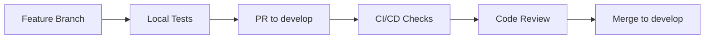
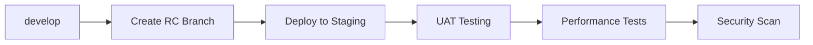
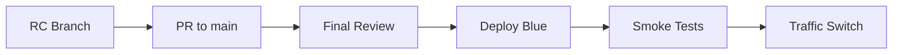

# HexProperty Deployment Architecture
Version: 1.0.0
Last Updated: 2024-01-10 14:32:45 GMT+2

## Version Control
- **Branch Strategy**: 
  - `main`: Production
  - `staging`: UAT/Staging
  - `develop`: Integration
  - `feature/*`: Feature branches
  - `fix/*`: Hot fixes
  - `release/*`: Release candidates

## Cloud-Native Serverless Architecture

### Development Environment
- **Local Development**:
  - Docker Desktop for local services
  - Local Next.js dev server
  - Local FastAPI server
  - LocalStack for AWS services simulation
  
### Staging Environment (Cost-Optimized)
All components are serverless/container-based to minimize costs:

#### Frontend
- **Next.js App**: Cloud Run
  - Auto-scaling: min=0, max=2
  - Memory: 512MB
  - CPU: 1
  - Concurrency: 80

#### Backend Services
- **API Layer**: Cloud Functions
  - Runtime: Node.js 18
  - Memory: 256MB
  - Timeout: 60s
  - Min instances: 0

- **Microservices**: Cloud Run
  - Auto-scaling: min=0, max=2
  - Memory: 512MB
  - Concurrency: 80

#### Data Layer
- **PostgreSQL**: Cloud SQL (serverless)
  - Min instances: 0
  - Max instances: 1
  - Auto-pause after 15min

- **Redis**: Memorystore
  - Basic tier
  - 1GB memory
  - No replication

#### Event Infrastructure
- **Kafka**: Serverless Kafka (Cloud Run)
  - Kafka in Docker on Cloud Run
  - Auto-scaling based on load
  - Zookeeper-less mode
  - Persistence: Cloud Storage

#### Monitoring
- **Logging**: Cloud Logging
- **Metrics**: Cloud Monitoring
- **Tracing**: Cloud Trace
- **Error Tracking**: Sentry (free tier)

### Production Environment
Similar architecture but with higher reliability:

#### Frontend
- **Next.js App**: Cloud Run
  - Min instances: 2
  - Max instances: 10
  - Memory: 1GB
  - CPU: 2
  - Regional deployment

#### Backend
- **API Layer**: Cloud Functions
  - Min instances: 1
  - Memory: 512MB
  - Regional deployment

- **Microservices**: Cloud Run
  - Min instances: 2
  - Max instances: 10
  - Regional deployment

#### Data Layer
- **PostgreSQL**: Cloud SQL
  - High availability
  - Point-in-time recovery
  - Automated backups

- **Redis**: Memorystore
  - Standard tier
  - High availability
  - 5GB memory

## Deployment Pipeline

### 1. Development

### 2. Staging

### 3. Production

## Cost Control Measures

### Development
- Local development uses minimal cloud resources
- Shared staging environment
- Auto-shutdown of unused resources

### Staging
- Zero minimum instances where possible
- Auto-scaling to zero when idle
- Smaller instance sizes
- Shared resources where possible
- No redundancy/HA requirements

### Production
- Auto-scaling based on actual load
- Resource limits to prevent runaway costs
- Regular cost monitoring and optimization
- Reserved instances for predictable workloads

## Monitoring and Alerts

### Cost Monitoring
- Daily budget tracking
- Alerts at 50%, 80%, 90% of budget
- Per-service cost attribution
- Anomaly detection

### Performance Monitoring
- Request latency
- Error rates
- Resource utilization
- User experience metrics

## Disaster Recovery
- Regular automated backups
- Cross-region replication (prod only)
- Documented recovery procedures
- Regular DR testing

## Security
- Least privilege access
- Service account rotation
- Secret management
- Regular security scans

## Compliance
- Audit logging
- Access tracking
- Data residency
- Backup retention
