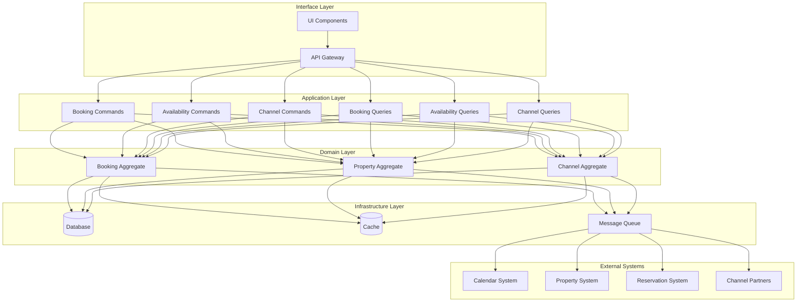
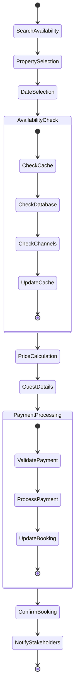
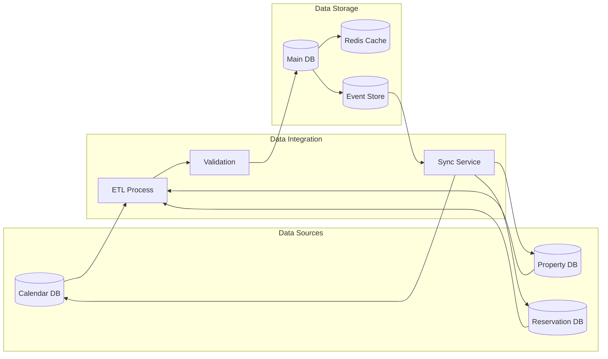
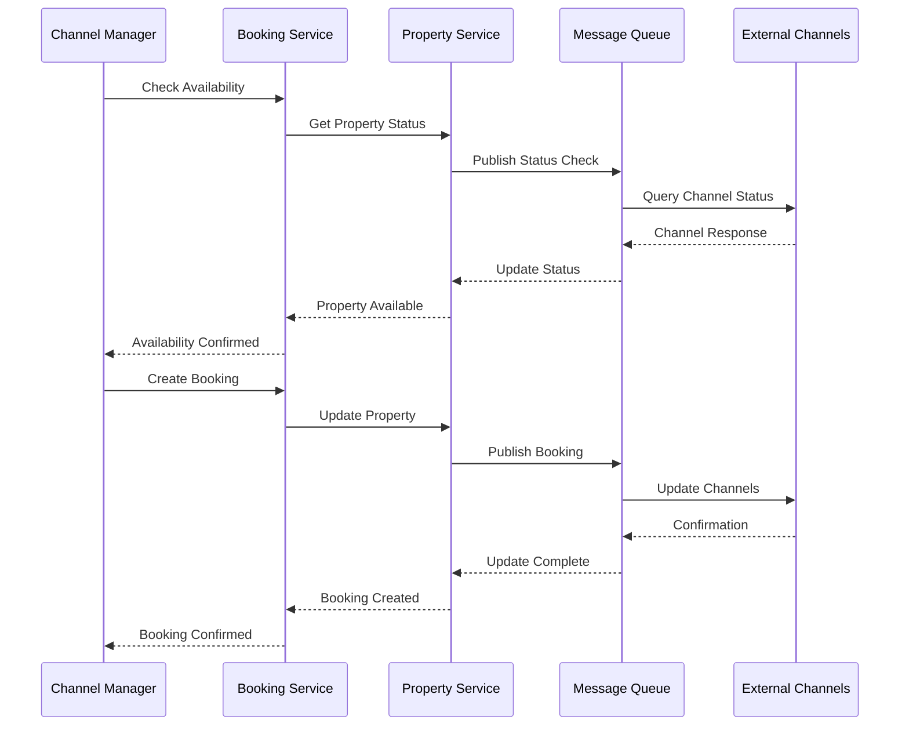
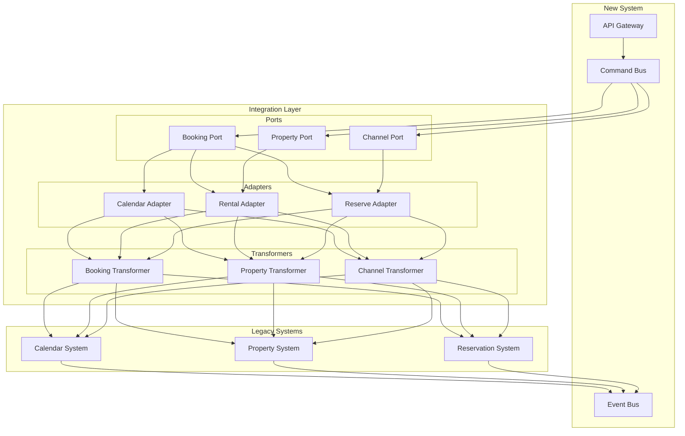

# Business Process Diagrams

## 1. System Architecture Overview


## 2. Booking Process Flow


## 3. Data Flow Architecture


## 4. Channel Integration Sequence


## 5. Integration Layer Architecture


## 6. Legacy Systems Analysis

```mermaid
graph TD
    subgraph "HexProperty tab"
        direction TB
        T1[Modern UI Components]
        T2[TypeScript/Next.js Stack]
        T3[State Management]
        T4[API Integration Patterns]
    end
    
    subgraph "HexProperty reserve"
        direction TB
        RS1[Advanced Booking Engine]
        RS2[Multi-Channel Management]
        RS3[Owner Portal & Reporting]
        RS4[Rate Management]
    end
    
    subgraph "HexProperty rental"
        direction TB
        R1[Property Management]
        R2[Unit & Inventory Control]
        R3[Tenant Management]
        R4[Billing & Invoicing]
    end
    
    subgraph "HexProperty cal"
        direction TB
        C1[Availability Engine]
        C2[Calendar Management]
        C3[Basic Booking Logic]
        C4[Schedule Optimization]
    end

    subgraph "New Booking System"
        direction TB
        UI[UI Layer]
        BL[Business Logic]
        DL[Data Layer]
    end

    T1 & T2 & T3 & T4 --> UI
    RS1 & RS2 & C1 & C2 --> BL
    R1 & R2 & RS3 & RS4 --> DL
```


### Component Inheritance Map

| Source System | Components to Inherit | Justification |
|---------------|---------------------|----------------|
| HexProperty tab | - Modern UI Components<br>- TypeScript/Next.js Stack<br>- State Management<br>- API Integration | Most recent tech stack, provides modern foundation |
| HexProperty reserve | - Advanced Booking Engine<br>- Multi-Channel Management<br>- Owner Portal & Reporting<br>- Rate Management | Most comprehensive booking functionality |
| HexProperty rental | - Property Management<br>- Unit & Inventory Control<br>- Tenant Management<br>- Billing & Invoicing | Core property management features |
| HexProperty cal | - Availability Engine<br>- Calendar Management<br>- Basic Booking Logic<br>- Schedule Optimization | Proven calendar and availability system |

### First Iteration Strategy
1. **Direct Component Copy**
   - Copy components with minimal modifications
   - Maintain existing business logic
   - Preserve proven workflows

2. **Integration Points**
   ```mermaid
   graph LR
       subgraph "Phase 1: Direct Copy"
           A[Copy Components] --> B[Verify Functionality]
           B --> C[Document Behavior]
       end
       
       subgraph "Phase 2: Integration"
           D[Connect Systems] --> E[Test Integration]
           E --> F[Validate Workflows]
       end
       
       C --> D
   ```

3. **Validation Strategy**
   - Test each component in isolation
   - Verify business logic accuracy
   - Ensure data consistency
   - Maintain existing APIs

## 7. Complete Implementation Roadmap

### Phase 1: Core Booking Infrastructure
1. **Availability Management** 
   - Cache implementation
   - Real-time checking
   - Channel synchronization
   - Conflict resolution

2. **Property Management**
   - Property data model
   - Unit management
   - Pricing rules
   - Availability rules

3. **Booking Process**
   - Booking creation
   - Status management
   - Modification handling
   - Cancellation process

### Phase 2: Channel Integration
1. **Channel Management**
   - Channel adapter framework
   - Data synchronization
   - Rate management
   - Inventory distribution

2. **External Systems**
   - Legacy system integration
   - API implementations
   - Data migration
   - Sync validation

### Phase 3: User Experience
1. **Booking Interface**
   - Search implementation
   - Booking workflow
   - Payment integration
   - Confirmation process

2. **Property Interface**
   - Property management
   - Calendar management
   - Rate management
   - Channel distribution

### Phase 4: Optimization
1. **Performance**
   - Caching strategy
   - Query optimization
   - Load balancing
   - Response time

2. **Scalability**
   - Horizontal scaling
   - Data partitioning
   - Event sourcing
   - CQRS implementation

### Phase 5: Analytics & Reporting
1. **Business Intelligence**
   - Booking analytics
   - Revenue management
   - Channel performance
   - Market analysis

2. **Operational Metrics**
   - System health
   - Performance metrics
   - Error tracking
   - Usage patterns
