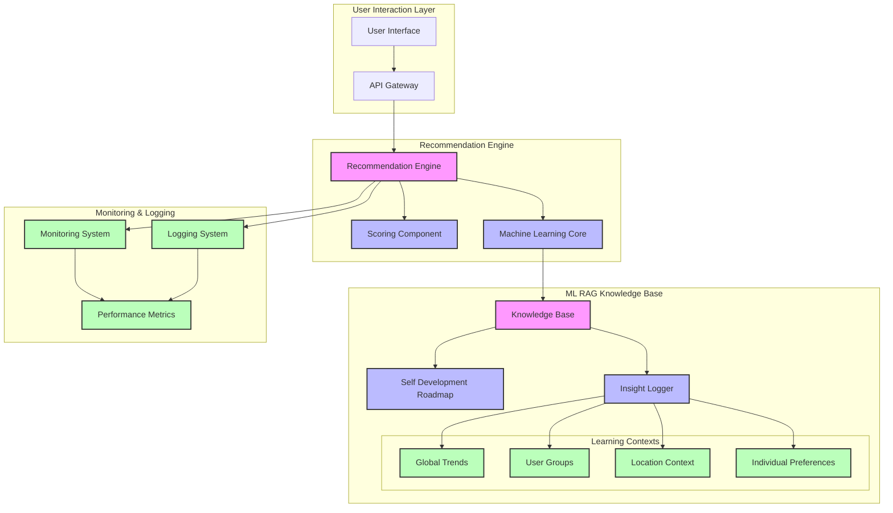

## HexProperty ML RAG Architecture

### Component Description

#### User Interaction Layer
- **UI**: Frontend interface for property recommendations
- **API Gateway**: RESTful/GraphQL interface for recommendation requests

#### Recommendation Engine
- **Recommendation Engine**: Core orchestration component
- **Scoring Component**: Multi-dimensional property scoring
- **Machine Learning Core**: ML model management and execution

#### ML RAG Knowledge Base
- **Knowledge Base**: Central learning repository
- **Self Development Roadmap**: Built-in improvement instructions
- **Insight Logger**: Captures and processes learning events
- **Learning Contexts**:
  - Global Trends: System-wide patterns
  - User Groups: Demographic insights
  - Location Context: Geographical preferences
  - Individual Preferences: User-specific learning

#### Monitoring & Logging
- **Monitoring System**: Real-time system health tracking
- **Logging System**: Structured event logging
- **Performance Metrics**: KPI tracking and analysis

### Data Flow
1. User requests flow through UI/API
2. Recommendation Engine processes requests
3. ML Core enhances recommendations with learned patterns
4. Knowledge Base provides contextual insights
5. Monitoring & Logging track system behavior

### Key Features
- Multi-dimensional learning
- Self-improvement capability
- Comprehensive monitoring
- Contextual awareness

### Technical Stack
- TypeScript/Node.js
- TensorFlow.js
- Zod Schema Validation
- File-based persistence (transitioning to DB)
