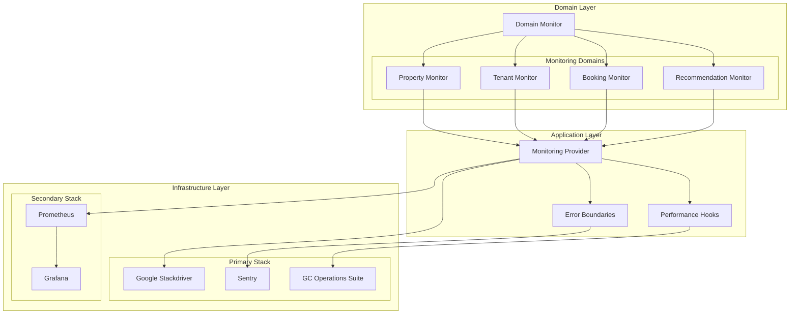

# HexProperty Monitoring Architecture

## Overview
This document outlines the domain-driven monitoring architecture for the HexProperty system, with switchable primary and secondary monitoring stacks.



## Monitoring Domains

### Property Domain Metrics
- Property View Rate
- Booking Conversion Rate
- Search Result Position
- Property Rating Distribution
- Recommendation Click-through Rate

### Tenant Domain Metrics
- Search Pattern Analysis
- Booking Frequency
- Preference Stability
- Session Duration
- Feature Usage Patterns

### Booking Domain Metrics
- Booking Success Rate
- Payment Processing Time
- Document Verification Speed
- Cancellation Rate
- Support Ticket Generation

### Recommendation Domain Metrics
- Recommendation Accuracy
- Learning Rate
- Model Performance
- Cache Hit Ratio
- Response Latency

## Provider Interface
```typescript
interface MonitoringProvider {
    // Metric Recording
    recordMetric(domain: MonitoringDomain, name: string, value: number): void;
    recordHistogram(domain: MonitoringDomain, name: string, value: number): void;
    
    // Error Tracking
    recordError(domain: MonitoringDomain, error: Error, context?: any): void;
    
    // Performance Monitoring
    startSpan(domain: MonitoringDomain, name: string): Span;
    recordLatency(domain: MonitoringDomain, name: string, duration: number): void;
    
    // Health Checks
    recordHealthCheck(domain: MonitoringDomain, status: HealthStatus): void;
}
```

## Primary Stack Implementation

### Google Stackdriver Integration
- Metric Export
- Log Aggregation
- Trace Collection
- Alert Configuration

### Sentry Integration
- Error Tracking
- Performance Monitoring
- Release Tracking
- User Context

### Google Cloud Operations Integration
- APM Metrics
- Service Dependencies
- Resource Utilization
- Custom Dashboards

## Secondary Stack Implementation

### Prometheus Integration
- Metric Scraping
- Custom Exporters
- Alert Rules
- PromQL Queries

### Grafana Integration
- Dashboard Templates
- Data Source Configuration
- Alert Management
- Visualization Panels

## Switchable Configuration
```typescript
interface MonitoringConfig {
    provider: 'primary' | 'secondary';
    errorTracking: {
        provider: 'sentry' | 'gcops';
        config: Record<string, unknown>;
    };
    performance: {
        provider: 'gcops' | 'grafana';
        config: Record<string, unknown>;
    };
    metrics: {
        provider: 'stackdriver' | 'prometheus';
        config: Record<string, unknown>;
    };
}
```

## Health Checks
- Service Health
- Dependency Health
- Resource Health
- Business Process Health

## Alert Configuration
- Severity Levels
- Notification Channels
- Alert Rules
- Escalation Policies

## Dashboard Templates
- Executive Overview
- Technical Operations
- Domain-Specific Views
- SLA Monitoring

## Best Practices
1. Use structured logging
2. Define clear metric naming
3. Set appropriate alert thresholds
4. Maintain dashboard consistency
5. Regular health check validation

## Security Considerations
1. Access Control
2. Data Privacy
3. Audit Logging
4. Compliance Monitoring

## Performance Impact
1. Sampling Strategies
2. Buffer Management
3. Batch Processing
4. Resource Optimization

## Version History
- v1.0 (2024-11-27): Initial monitoring architecture documentation
